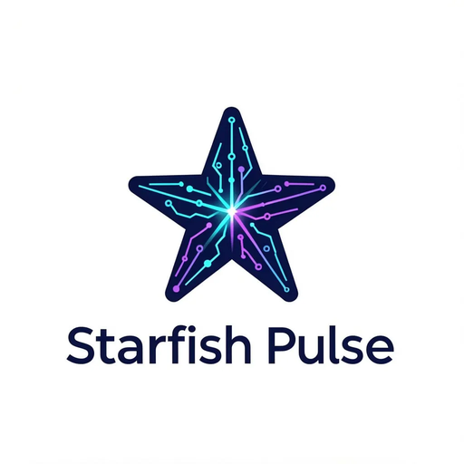

<div id="starfish-pulse-logo" align="center">
    <br />
    
    <h1>Starfish Pulse</h1>
    <h3>Specialized Premium .NET & C# VibeCoding IDE</h3>
    <p>Developed by Jan Jalinski (Founder of Starfish Logic Labs)</p>
</div>

<div id="badges" align="center">

[](https://github.com/StarFish-Logic-Labs/Starfish-Pulse/releases)
[](https://github.com/StarFish-Logic-Labs/Starfish-Pulse/blob/dev/LICENSE)

</div>

---

**Starfish Pulse** is a custom VibeCoding IDE specialized for **.NET and C# development**, built on top of a clean VSCodium core. It provides deep context-awareness by reading project structure files (`.sln`, `.csproj`) and compiler diagnostics, and integrates seamlessly with local LLMs via **Ollama** and custom pipelines via **n8n**.

## Key Features

- 🧠 **Local LLM Integration**: Stream responses locally from Ollama (pre-configured for `qwen2.5-coder:14b` optimized for your GPU) or remote cloud endpoints.
- 🔗 **n8n Pipeline Automations**: Leverage automated workflows on your n8n VPS server (`https://n8n.peweez.cloud`) for complex code synthesis.
- 🎯 **C# / .NET Context Extractor**: Automatically scans active solutions and compiles diagnostic error reports to supply the LLM with precise context.
- 💎 **Premium Glassmorphic UI**: Beautiful sidebar layout with micro-animations and syntax highlighting designed for immersive code generation.

## How to Build

Detailed build instructions can be found in [docs/howto-build.md](./docs/howto-build.md).

### Quick Preparation and Build
1. **Prepare VS Code Source Tree**:
   Run the preparation script to clone Microsoft VS Code, apply branding patches, configure the MSBuild environment, and compile native dependencies:
   ```bash
   ./prepare_vscode.sh
   ```
2. **Compile Stable Executables**:
   Build the rebranded binaries:
   ```bash
   ./dev/build.sh
   ```

## Why Starfish Pulse?
Like VSCodium, Starfish Pulse is built directly from the open-source MIT-licensed VS Code codebase. By replacing Microsoft's proprietary telemetry layers, default extension galleries, and branding with open counterparts, it guarantees complete privacy and full codebase control. We extend this foundation with specialized tools to make C# development fast and frictionless.

## License
MIT License
